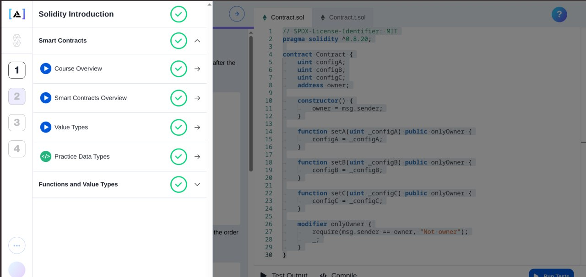

<p align="center">
  
</p>

# 💎 Module 1 — Solidity Fundamentals

Welcome to the foundational training ground of your smart contract journey! This module covers the essential building blocks of **Solidity**: from basic primitive data types and memory-optimized layouts to function types (`pure`, `view`, and state-changing), constructor arguments, method overloading, and testing with **Foundry**.

Every exercise here is a self-contained smart contract paired with a corresponding Foundry test file.

---

## Table of Contents

- [Overview](#overview)
- [Project Structure](#project-structure)
- [Prerequisites](#prerequisites)
- [Setup](#setup)
- [Running the Tests](#running-the-tests)
- [Exercises](#exercises)
  - [Data Types](#data-types)
  - [Solidity Functions](#solidity-functions)
- [Learning Outcomes](#learning-outcomes)

---

## Overview

Module 1 is split into two thematic groups:

| Group | Purpose |
|-------|---------|
| **data-types** | Practice declaring and using Solidity's primitive types (`bool`, `uint`, `int`, `string`, `enum`). |
| **Solidity-Functions** | Practice writing constructors, `pure` / `view` functions, state-changing functions, and overloaded functions. |

Every exercise is a fully working contract under `<exercise>/Contract.sol` with a matching test in `<exercise>/Contract.t.sol`.

---

## Project Structure

```
module-1/
├── README.md
│
├── data-types/
│   ├── booleans/              # bool variables (true / false)
│   ├── Enum/                  # Enum declaration & default values
│   ├── Signed-Integers/       # int8 / int16 arithmetic
│   ├── String-Literals/       # string storage variables
│   └── Unsigned-Integers/     # uint256 arithmetic
│
└── Solidity-Functions/
    ├── Arguments/             # Constructor with a parameter
    ├── Console-Log/           # Pure function with string param
    ├── Double-Overload/       # Function overloading
    ├── Increments/            # State-modifying function
    ├── Pure-Double/           # Simple pure function
    └── View-Addition/         # View function reading state
```

Each leaf folder contains:

- `Contract.sol` — the Solidity contract for that exercise
- `Contract.t.sol` — the Foundry test file (imports from `../src/Contract.sol`)

---

## Prerequisites

You will need:

- **[Foundry](https://book.getfoundry.sh/)** — the toolchain used for compiling and testing (`forge`, `cast`, `anvil`).
- **Git** — for cloning the repository.
- **A terminal** — PowerShell, Bash, or Windows Terminal.

### Install Foundry

**Linux / macOS / WSL:**
```bash
curl -L https://foundry.paradigm.xyz | bash
foundryup
```

**Windows (PowerShell):**
```powershell
# Install via WSL is recommended, or use the Windows installer:
irm https://foundry.paradigm.xyz | iex
foundryup
```

Verify the install:
```bash
forge --version
```

---

## Setup

1. **Clone the repository**

   ```bash
   git clone <your-repo-url>
   cd blockchain-assignment/module-1
   ```

2. **Initialize a Foundry project** (if `foundry.toml` does not already exist at the repo root):

   ```bash
   forge init --no-commit --force
   ```

3. **Install Foundry standard library** (used by the test files):

   ```bash
   forge install foundry-rs/forge-std --no-commit
   ```

4. **Per-exercise layout note**

   Each exercise's test file imports its contract from `../src/Contract.sol`. To run a single exercise in isolation, place the contract under `src/` and the test under `test/`:

   ```
   <exercise>/
   ├── src/
   │   └── Contract.sol
   └── test/
       └── Contract.t.sol
   ```

---

## Running the Tests

From the root of an exercise folder configured as a Foundry project:

```bash
# Run all tests
forge test

# Run with verbose traces
forge test -vvv

# Run a specific test function
forge test --match-test testConstructor

# Run a specific contract
forge test --match-contract ContractTest
```

To compile contracts only:
```bash
forge build
```

---

## Exercises

### Data Types

| Exercise | File | Concept |
|---------|------|---------|
| **booleans** | `data-types/booleans/Contract.sol` | Declares `bool a = true` and `bool b = false`. |
| **Enum** | `data-types/Enum/Contract.sol` | Declares an enum `Foods { PIZZA, BURGER, SUSHI, PASTA }` and four state variables of that type. |
| **Signed-Integers** | `data-types/Signed-Integers/Contract.sol` | Computes the absolute difference between an `int8` and a negative `int8`, returning `int16`. |
| **String-Literals** | `data-types/String-Literals/Contract.sol` | Stores two `string` state variables (short and long literal). |
| **Unsigned-Integers** | `data-types/Unsigned-Integers/Contract.sol` | Adds two `uint256` state variables via a `view` function. |

### Solidity Functions

| Exercise | File | Concept |
|---------|------|---------|
| **Arguments** | `Solidity-Functions/Arguments/Contract.sol` | Constructor that accepts a `uint256` and stores it in state. |
| **Console-Log** | `Solidity-Functions/Console-Log/Contract.sol` | `pure` function `winningNumber(string)` that ignores its input and returns `794`. |
| **Double-Overload** | `Solidity-Functions/Double-Overload/Contract.sol` | Two overloaded `double` functions — one taking a single `uint256`, one taking two. |
| **Increments** | `Solidity-Functions/Increments/Contract.sol` | `increment()` function that mutates state by `x += 1`. |
| **Pure-Double** | `Solidity-Functions/Pure-Double/Contract.sol` | `pure` function returning `x * 2`. |
| **View-Addition** | `Solidity-Functions/View-Addition/Contract.sol` | `view` function `add(y)` returning `x + y` where `x` is state. |

---

## Learning Outcomes

By completing Module 1 you will be comfortable with:

- Writing the SPDX license header and selecting a `pragma` version.
- Declaring and initializing Solidity's primitive types.
- Defining and using `enum` types with their implicit integer ordering.
- Casting between integer types (`int8` ⇄ `int16`) safely.
- Writing constructors that initialize state variables.
- Distinguishing between `pure`, `view`, and state-changing functions.
- Overloading functions by parameter signature.
- Writing and running Foundry unit tests using `forge-std/Test.sol`.

---

## Next Steps

Once you are comfortable with Module 1, move on to **`module-2`** which builds on these primitives with mappings, structs, and more advanced contract patterns.
